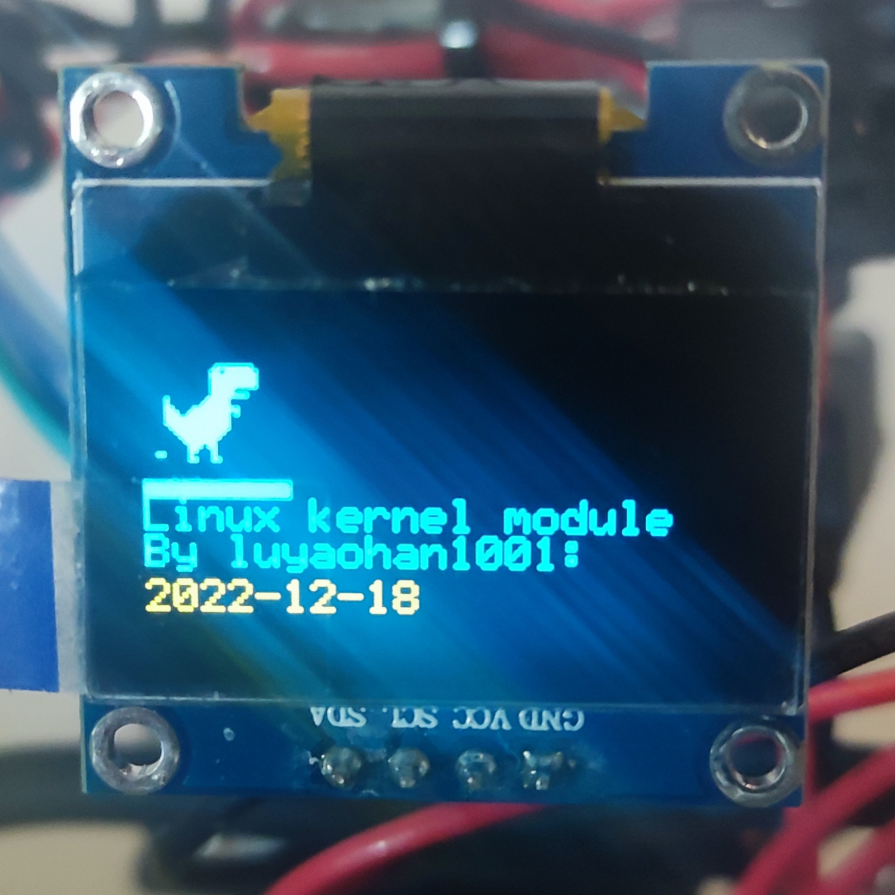
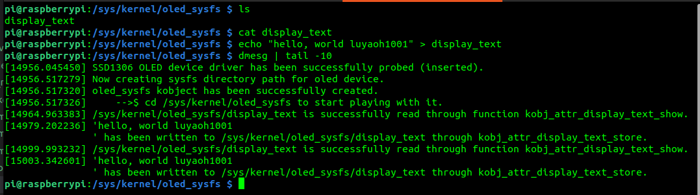

## Linux Loadable Kernel Module Driver for SSD1306 OLED.

    Source code hierarchy:

                    oled_sysfs
                        |
                     graphics
                        |
                     datalink
                        |
                  driver  oled.dts

    Tested on Linux raspberrypi 5.10.103-v7l+ #1529 SMP Tue Mar 8 12:24:00 GMT 2022 armv7l GNU/Linux 
    (Raspberry Pi Buster.)

    PDF documents generated (by doxygen) at /docs/latex/refman.pdf

#### Demo: Displaying text and the dinosaur graphics from chrome browser.

#### Demo: Displaying sysfs oled_sysfs (kobject-mapped directory) from terminal.

#### Documentation.

#### To compile.

    Install the kernel headers.
    $ sudo apt install raspberrypi-kernel-headers

    Compile
    $ sudo make

    Successful compile message example:
    pi@raspberrypi:~/Projects/raspberrypi-4b/drivers/oled $ make
        make -C /usr/src/linux-headers-5.10.103-v7l+ \
                ARCH=arm CROSS_COMPILE=arm-linux-gnueabihf- \
                M=/home/pi/Projects/raspberrypi-4b/drivers/oled modules
        make[1]: Entering directory '/usr/src/linux-headers-5.10.103-v7l+'
          CC [M]  /home/pi/Projects/raspberrypi-4b/drivers/oled/oled_sysfs.o
          LD [M]  /home/pi/Projects/raspberrypi-4b/drivers/oled/oled_driver.o
          MODPOST /home/pi/Projects/raspberrypi-4b/drivers/oled/Module.symvers
          CC [M]  /home/pi/Projects/raspberrypi-4b/drivers/oled/oled_driver.mod.o
          LD [M]  /home/pi/Projects/raspberrypi-4b/drivers/oled/oled_driver.ko
        make[1]: Leaving directory '/usr/src/linux-headers-5.10.103-v7l+'

#### To run:

    1. First apply device tree overlay by

        $ sudo make dtoverlay

    2. Insert the kernel module

        $ sudo make insmod

#### To check for printk log:

        $ dmesg

#### To remove the kernel module:

        $ sudo dmesg

#### To generate docs by doxygen

        $ make doxygen

        $ cd /docs/html

#### Kanban - TODO

- [x] release-00: Minimal-viable kernel i2c bus module and simple configruation + fill-screen.
    - Constructing Makefile, setup build-environment (linux kernel headers)
    - Understanding struct i2c_client , struct i2c_driver.
    - Implementing probe and remove callbacks when the kernel inserts/remove the driver.

- [x] release-01: Add font / image support to the screen datalink layer.
    - Reading and coding various display functionalities according to SSD1306 I2C interface defined by Solomon Systech datasheet.

- [x] release-02: Add user-space interface through sysfs.
    - Understanding struct kobject, kobj_attrbute.
    - Providing implementation on the creation of the oled device as a sysfs folder.
    - Providing implementation on the creation of oled attributes such as display_text, brightness, etc. as files in that sysfs folder.

- [ ] release-03: Develop the dinosaur game on this screen.
    - Add multi-threading protection to critical sections.
    - Develop user-space dinosaur game, interacting with the kernel module through oled_sysfs.

- [ ] release-04: Unit testing.
    - TBD

